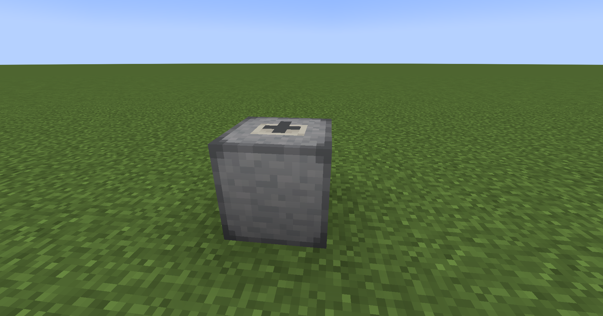

# CenozoicKingdom

# 🦴 Cenozoic Kingdom

A Minecraft 1.18.2 Fabric mod that brings ancient creatures back to life! BTW my first mod ever, so I am excited and pleased to say that this mod is Open-Source

**Disclaimer**: Some assets are placeholders, some assets are missing but will be definetely changed in future, this very early pre-alpha 0.0.1 version is only to demonstrate ideas for mod

## 📦 What is Cenozoic Kingdom?

Cenozoic Kingdom is a mod focused on **prehistoric life, ancient DNA, and fossil technology**. Collect, analyze, and synthesize DNA from the past to reconstruct the creatures of the Cenozoic era—and beyond.

## 🔬 Features

- **Analyzer Block**  
  Process items like `frozen_bone`, `frozen_meat`, and `frozen_skin` to extract ancient DNA. (names/tags will maybe change in the future)

- **Synthetizer Block**  
  Combine basic DNA (e.g. `cenozoic_dna`, `paleozoic_dna`, `modern_dna` (all are very, very, very early names, and are definetely subject to change) to create **specific DNA** (like `mastodon_dna`, `dimetrodon_dna` (more to come in future...).

- **Mutation System**  
  Some materials may yield rare `mutated_dna` or `hybrid_dna`—these are unstable and unpredictable... (very, very, very future feature...)

- **Destroyed DNA Failures**  
  Not every synthesis goes as planned—failures will give you `destroyed_dna`. (partially implemented, subject to change)

## 🛠️ Requirements

- Minecraft **1.18.2**
- [Fabric Loader](https://fabricmc.net/)
- [Fabric API](https://modrinth.com/mod/fabric-api)

## 🔧 Installation

1. Install **Fabric** for Minecraft 1.18.2.
2. Download and place the latest version of **Cenozoic Kingdom** in your `/mods` folder.
3. Launch the game and enjoy!

## 📷 Screenshots

## PERMAFROST TEXTURE (subject may change)

## ANALYZER TEXTURE (subject may change)

# SYNTHESIZER TEXTURE (subject will change)

# GUI TEXTURE (subject may/will change)

## 🧪 Planned Features

- Cloning chambers and prehistoric creatures.
- Advanced mutation trees and unstable hybrids.
- Fossil excavation mechanics. (you will need special equipment, now you basically need a minecraft iron pickaxe :( )

## 💬 Join the Community

Join the discussion and report bugs on our **[Discord server](https://discord.gg/pHQvYqYaZc)**.

## 📂 Open Source

This project is licensed under the **MIT License**.  
Feel free to fork, modify, and contribute!

---

### 👨‍💻 Developed by: Containment Creations  
Made with ❤️ by indie modders and dino nerds.
